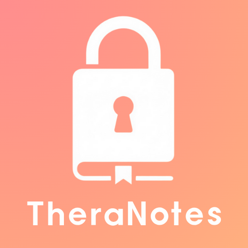

# TheraNotes

<div align="center">



**安全、本機優先的個人諮商紀錄系統**

A secure, local-first personal counseling record system

[](https://theranotes.dpdns.org/)
[](https://theranotes.dpdns.org/)
[](https://tauri.app/)
[](https://svelte.dev/)

[官方網站](https://theranotes.dpdns.org/) • [下載安裝](https://theranotes.dpdns.org/TheraNotesDownload) • [贊助支持](https://portaly.cc/TheraNotes/support)

</div>

---
## ✨V1.3.0全新功能
- ✨ 新增記錄匯出功能：現在可以匯出 PDF、Word 或 TXT 文字檔了！
- ✨ 支援選擇是否連同個案資料一同匯出
- ✨ 支援選擇特定晤談次數進行匯出
- 🎨 美化 PDF 排版，提升匯出文件的可讀性
- 🔧 嘗試 MacOS 相容性打包發布Beta版本 ── 現在可以支援MacOS系統了

#### MacOS安裝步驟
※由於本程式尚未取得Apple inc.之數位簽章，安裝時會跳出無法使用或是無效安裝程式等訊息。
若有疑慮請等待TheraNotes取得數位簽章後再行下載（有可能很久，因為簽章需要年費，而本專案無固定收入）

1. 下載適用於MacOS的安裝包（M系列晶片下載macos-aarch64-apple-darwin.zip；Intel系列晶片下載macos-x86_64-apple-darwin.zip）
2. 在Finder中找到TheraNotes.app
3. 按住Control鍵並點擊應用程式
4. 選擇「打開」
5. 在彈出的對話框中點擊「打開」
6. 安裝完成

---

## 📖 關於 TheraNotes

TheraNotes 是一款專為心理師設計的**個案管理系統**，提供安全的本機資料儲存、自動儲存功能，以及便捷的諮商紀錄管理。

### 💡 開發初衷

> 嗨，我是開發 TheraNotes 的製作者 Ori_Lee，
>
> 我現在是一名碩三實習中的諮商心理師。在實習過程中，我發現當案量提升時，我們的大腦已經無法隨時記得每個案主的狀況。這對助人者是認知的耗竭、對案主是損害到接受有效晤談的權益、對學習而言也是進入無效能感。
>
> 一開始我嘗試用 Google Sheets 記錄，但雲端儲存有資安風險；改用 Excel 後，又發現不適合儲存長篇文字。因此，**TheraNotes 誕生了**——一個本機優先、注重資料安全的個案管理系統。

---

## ✨ 主要功能

### 🎯 核心特色

- **完全免費**：無需付費即可使用完整功能
- **隱私至上**：所有資料完全本機儲存，不上傳雲端
- **專業設計**：為心理師量身打造的介面與工作流程
- **穩定可靠**：經過實際諮商場域測試與優化

### 🚧 未來計畫

- **行事曆視圖**：個案依固定晤談時間排序在行事曆上一目了然
- **✅使用者自訂設定**：
  - ✅自訂資料庫檔案儲存位置
  - ✅修改資料庫密碼功能
- **✅個案紀錄匯出**：支援匯出個案資料為 PDF、DOC、TXT 等格式
- **多語系支援**：提供英文介面選項
- **資料備份與還原**：
  - 一鍵備份整個資料庫到指定位置
  - 自動定期備份（可設定頻率）
  - 備份加密（使用相同或獨立密碼）
  - 備份還原功能
- **附件管理**：讓使用者可以上傳相關文件
- **統計儀表板**：個案統計圖表、晤談次數統計等
- **範本管理系統**：自訂諮商紀錄範本、範本庫管理


### 🔐 資料安全
- **本機加密儲存**：使用 SQLCipher 加密資料庫
- **無雲端同步**：所有資料完全儲存在本機
- **密碼保護**：首次啟動時設定資料庫密碼

### 📝 個案管理
- **完整的個案資料**：姓名、代號、性別、出生日期、證號等基本資料
- **風險評估**：風險等級、通報狀態追蹤
- **個案狀態**：晤談中、結案、暫停等狀態管理
- **定期晤談設定**：記錄固定晤談時段（如每週三下午 2:00）
- **備註欄位**：彈性記錄其他重要資訊

### 📋 諮商紀錄
- **晤談紀錄撰寫**：包含晤談內容、評估、後續計畫
- **心理師札記**：記錄對晤談的想法、困惑、督導意見
- **預設模板**：提供結構化的紀錄模板，提升記錄效率
- **紀錄編輯與刪除**：完整的 CRUD 操作

### 🔍 搜尋與排序
- **快速搜尋**：支援姓名、代號、狀態、證號等多欄位搜尋
- **智慧排序**：依下次晤談時間、建立日期、姓名排序
- **即時過濾**：搜尋結果即時顯示，並統計符合筆數

### 💾 自動儲存
- **表單自動儲存**：所有表單內容自動儲存至 localStorage
- **意外保護**：即使意外關閉，下次開啟會詢問是否恢復
- **獨立儲存空間**：每個表單/個案有獨立的自動儲存空間

### ⌨️ 鍵盤快捷鍵
- **Ctrl + 滾輪**：縮放畫面（50%-200%）
- **Ctrl + S**：快速儲存表單
- **Alt + 1**：回到個案總覽
- **Alt + N**：跳轉到新增個案
- **Alt + F**：搜尋個案
- **F1 或 Ctrl + /**：顯示快捷鍵說明
- **Esc**：關閉彈窗/取消操作

### 🎨 使用者介面
- **響應式設計**：適應不同螢幕尺寸
- **溫暖配色**：舒適的米色和暖灰色調
- **清晰的視覺層次**：卡片式設計，資訊一目了然
- **無障礙支援**：鍵盤操作友善

---

## 📥 下載安裝

### 系統需求
- **作業系統**：Windows 10/11 (64-bit)
- **硬碟空間**：約 50 MB
- **記憶體**：建議 4 GB 以上

### 下載方式

請前往 [官方網站下載頁面](https://theranotes.dpdns.org/TheraNotesDownload) 下載最新版本。

### 安裝選項

#### 🎯 推薦：NSIS 安裝版
```
TheraNotes_x.x.x_x64-setup.exe
```
- ✅ 自動建立開始選單和桌面捷徑
- ✅ 完整的安裝與解除安裝程式
- ✅ 資料庫儲存在安全的 AppData 位置
- ✅ 內建所有必要運行庫

> **⚠️ 安裝時的 Windows 安全性警告**
>
> 首次安裝時，Windows SmartScreen 可能會顯示「Windows 已保護您的電腦」或「不明的發行者」警告。這是因為 TheraNotes 目前尚未取得程式碼簽章憑證（年費約 $100-400 美元）。
>
> **這不代表應用程式是惡意軟體**，而是 Windows 對未簽章軟體的標準警告機制。TheraNotes 是由個人開發者製作的免費軟體，經過實際諮商場域測試與使用。
>
> **安裝步驟：**
> 1. 當出現「Windows 已保護您的電腦」警告時，點擊「其他資訊」
> 2. 點擊「仍要執行」按鈕
> 3. 繼續完成安裝程序
>
> 您也可以選擇下方的**攜帶版（免安裝）**，解壓縮後直接執行即可使用。

#### 🏢 若您有電腦最高權限：MSI 安裝檔
```
TheraNotes_x.x.x_x64_en-US.msi
```
- ✅ Windows 標準企業安裝格式
- ✅ 支援靜默安裝和群組原則
- ✅ 適合企業或機構環境部署

#### 🎒 攜帶版：ZIP 壓縮檔
```
TheraNotes_x.x.x_Portable.zip
```
- ✅ 免安裝，解壓即用
- ✅ 適合 USB 隨身碟攜帶
- ✅ 無需管理員權限
- ⚠️ 資料庫儲存在程式目錄，請勿隨意移動

---

## 🚀 快速開始

### 首次使用

1. **安裝/解壓縮**應用程式
2. **啟動 TheraNotes**
3. **設定資料庫密碼**（請妥善保管，遺失無法復原）
4. 開始使用！

### 基本操作

#### 新增個案
1. 在個案總覽頁面，點擊「新增個案」區塊
2. 填寫個案基本資料
3. 按 **Ctrl + S** 或點擊「送出」儲存

#### 編輯個案
1. 點擊個案卡片
2. 在個案詳細頁面點擊「編輯個案資料」
3. 修改後按 **Ctrl + S** 儲存

#### 新增諮商紀錄
1. 進入個案詳細頁面
2. 點擊「新增諮商紀錄」
3. 填寫晤談內容和心理師札記
4. 按 **Ctrl + S** 儲存

#### 搜尋個案
- 按 **Alt + F** 快速聚焦搜尋框
- 輸入關鍵字（姓名、代號、狀態、證號）
- 即時顯示符合的個案

---

## 🛠️ 技術架構

TheraNotes 採用現代化技術堆疊打造，確保效能、安全性與使用者體驗：

### 前端技術
- **框架**：SvelteKit 2.9 + Svelte 5
- **樣式**：TailwindCSS 3.4
- **狀態管理**：Svelte Stores + Svelte 5 Runes
- **建置工具**：Vite 6

### 後端技術
- **桌面框架**：Tauri 2.0
- **程式語言**：Rust 2021
- **資料庫**：SQLite + SQLCipher（加密）

### 安全性
- **資料加密**：SQLCipher AES-256 加密
- **本機儲存**：所有資料完全本機化，不經網路傳輸
- **密碼保護**：資料庫層級的密碼驗證機制

---

## 🔒 隱私與安全

### 資料儲存
- **完全本機化**：所有資料儲存在您的電腦上
- **無網路連線**：應用程式不會連接網路（除了開啟外部連結）
- **加密保護**：使用業界標準的 SQLCipher AES-256 加密

### 資料位置
- **安裝版**：`%APPDATA%\com.orilee.theranotes\
- **攜帶版**：程式執行檔所在目錄

### 資料備份建議
1. 定期複製資料庫檔案（`TheraNotes.db`）
2. 將備份存放在安全的位置（加密硬碟、USB 等）
3. **重要**：請記住您的資料庫密碼，遺失無法復原

---

## 💬 問題回報與功能建議

如果您在使用過程中遇到任何問題，或有功能改進建議，歡迎透過以下方式聯繫：

- **Email**：lee2952000@gmail.com
- 詳細描述您遇到的問題或建議內容
- 附上螢幕截圖或錯誤訊息（如有）

您的回饋對 TheraNotes 的改進非常重要！

---

## 📄 授權與使用條款

TheraNotes 是**免費軟體**，您可以自由下載使用。

**使用限制：**
- ✅ 個人使用
- ✅ 機構內部使用
- ✅ 教學與研究用途
- ❌ 不得將本軟體重新打包後販售或散佈
- ❌ 不得逆向工程或反編譯

---

## 💖 支持專案

TheraNotes 是完全免費的軟體。如果這個專案對您有幫助，歡迎：

- 📢 推薦給您的同事或朋友
- 🐛 回報問題或建議功能
- 💝 [贊助支持](https://portaly.cc/TheraNotes/support) - 請開發者喝杯咖啡 ☕

---

## 📮 聯絡方式

- **開發者**：Ori_Lee
- **Email**：lee2952000@gmail.com
- **官方網站**：[https://theranotes.dpdns.org/)
- **贊助支持**：[https://portaly.cc/TheraNotes/support](https://portaly.cc/TheraNotes/support)

---

## 🙏 致謝

感謝所有使用 TheraNotes 的心理師和實習生們。你們的回饋讓這個專案持續進步。

特別感謝以下開源專案：
- [Tauri](https://tauri.app/) - 讓桌面應用開發變得簡單
- [Svelte](https://svelte.dev/) - 優雅的前端框架
- [SQLCipher](https://www.zetetic.net/sqlcipher/) - 提供安全的資料加密

---

## 📝 更新日誌

### V1.3.0 (2025-10-13)

#### 新功能
- ✨ 新增記錄匯出功能：現在可以匯出 PDF、Word 或 TXT 文字檔了！
- ✨ 支援選擇是否連同個案資料一同匯出
- ✨ 支援選擇特定晤談次數進行匯出
- 🎨 美化 PDF 排版，提升匯出文件的可讀性
- 🔧 嘗試 MacOS 相容性打包發布

#### 備註
- 📌 目前 PDF 匯出效果可能仍不盡人意，建議匯出文字格式編輯後再自行轉成 PDF

### V1.2.4 (2025-10-07)

#### 改進
- 🔧 改進登入頁面邏輯
- 🐛 修復已知問題

### V1.2.3 (2025-10-06)

#### 改進
- ✨ 改進首次開啟時的流程與用戶體驗
- ✨ 強化登入指引

### V1.2.0 (2025-10-06)

#### 新功能
- ✨ 新增隱藏已結案個案篩選按鈕

#### 修復
- 🐛 修復在非首頁按下快速搜尋及快速新增個案快捷鍵無效的問題

### V1.1.0 (2025-10-05)

#### 新功能
- ✨ 新增首次開啟應用程式時的設定流程

### V1.0.0 (2025-10-05) - 正式發布

#### 核心功能
- ✨ 完整的個案管理系統
- ✨ 諮商紀錄撰寫與管理
- ✨ 自動儲存功能
- ✨ 鍵盤快捷鍵支援
- ✨ 畫面縮放功能（50%-200%）
- ✨ 搜尋與排序功能
- ✨ 資料庫加密保護

#### 技術
- 🔧 使用 Tauri 2.0 + Svelte 5
- 🔧 SQLCipher 加密資料庫
- 🔧 完整的安裝檔打包（MSI、NSIS、攜帶版）

---

<div align="center">

**用心製作 | Made with ❤️ by Ori_Lee**

如果這個專案對您有幫助，歡迎 [贊助支持](https://portaly.cc/TheraNotes/support) 💝

</div>
